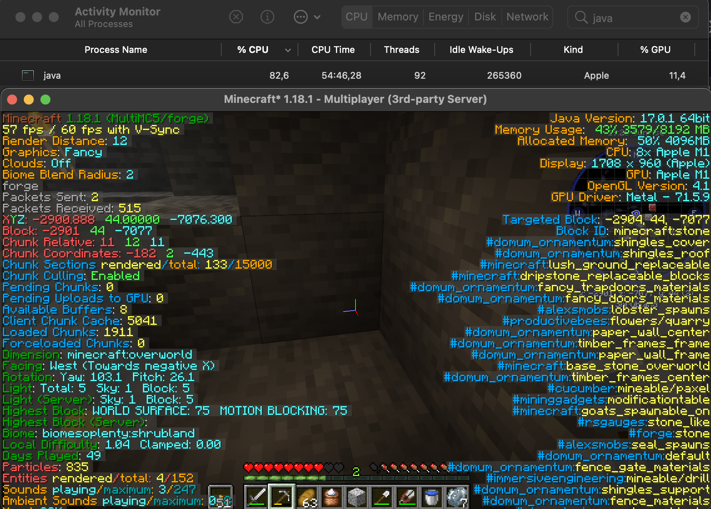

# mc-lwjgl-3.3.0-json-hack
Run minecraft 1.18.1 with forge 39.0.20 natively on Apple Silicon M1 ARM64 using LWJGL 3.3.0

Tested with modpack ATM 7 0.2.29 and 0.2.30 

Instructions:
1. Download and install MultiMC
2. Create a new instance
3. Make sure to use the correct java version. ie. zulu jdk 17 or equivalent for arm64, downloadable from https://cdn.azul.com/zulu/bin/zulu17.30.15-ca-jdk17.0.1-macosx_aarch64.dmg
4. Open the instance directory and replace /patches/org.lwjgl3.json with the one from this repository
5. Enjoy

